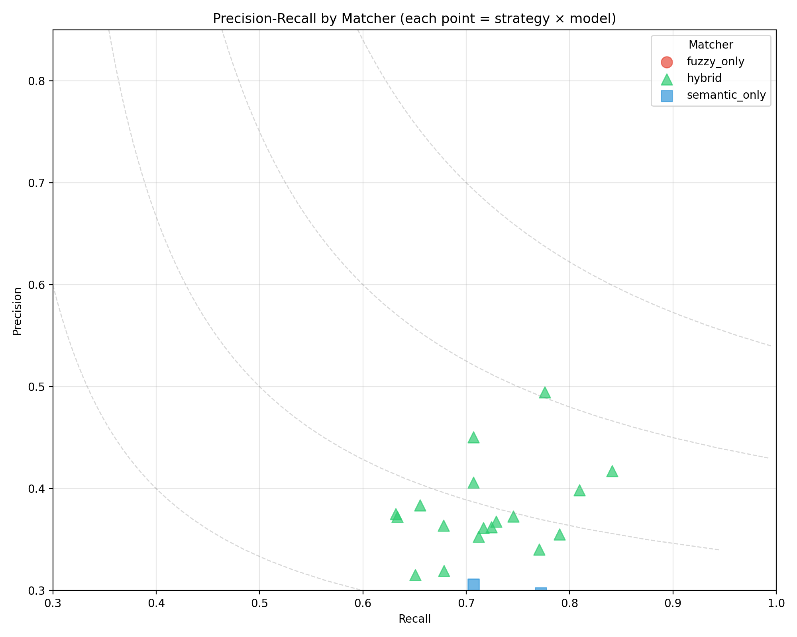
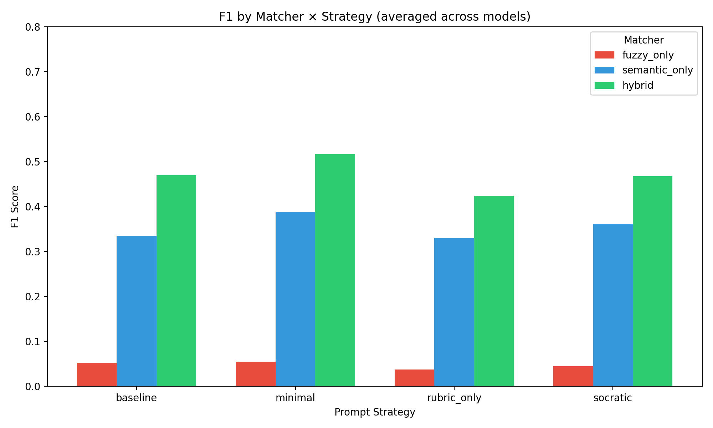
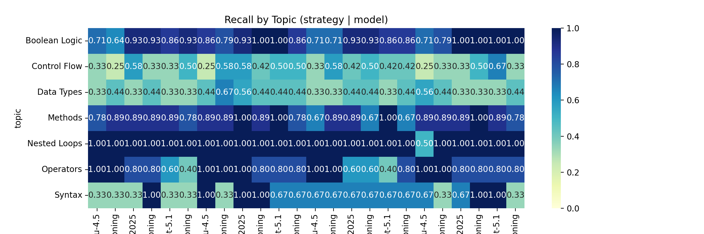
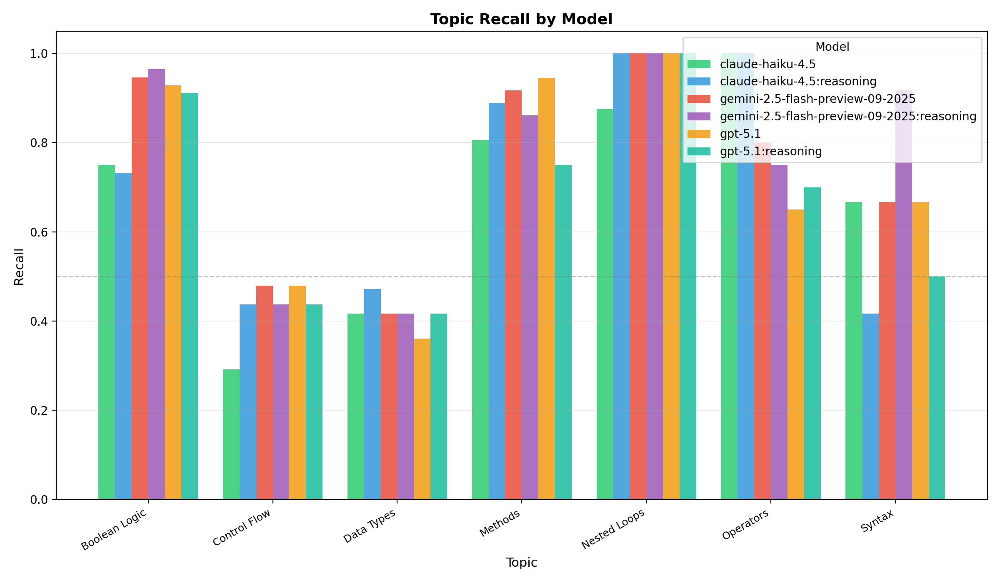
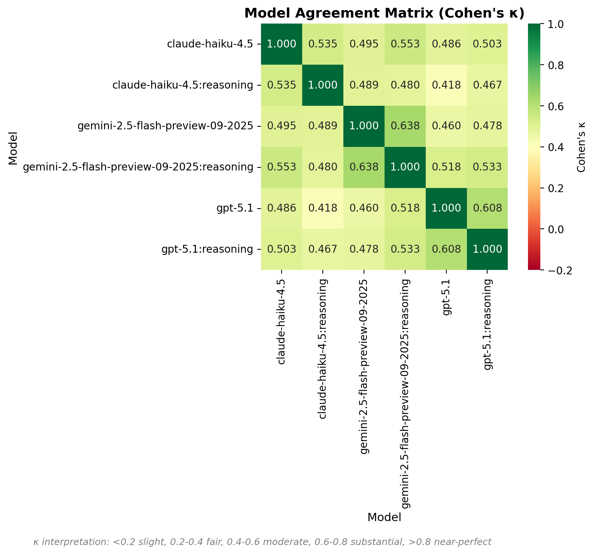
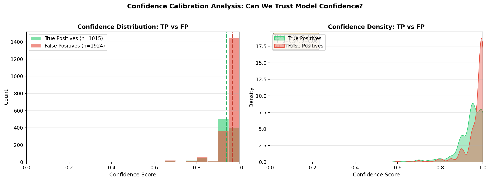
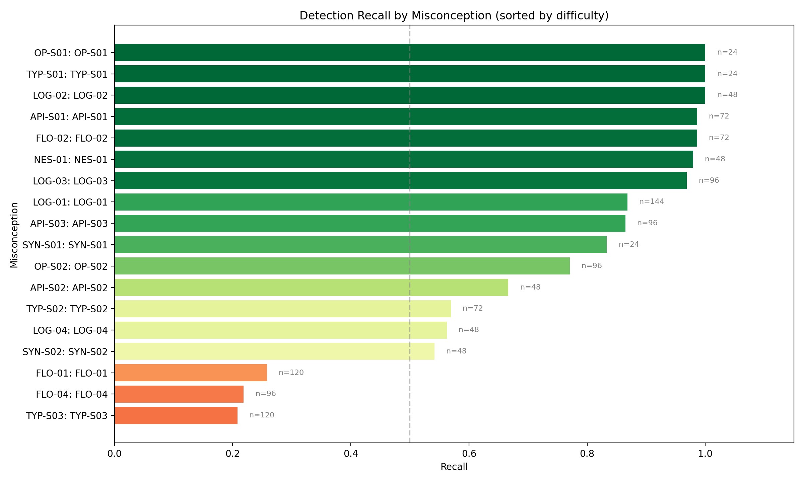
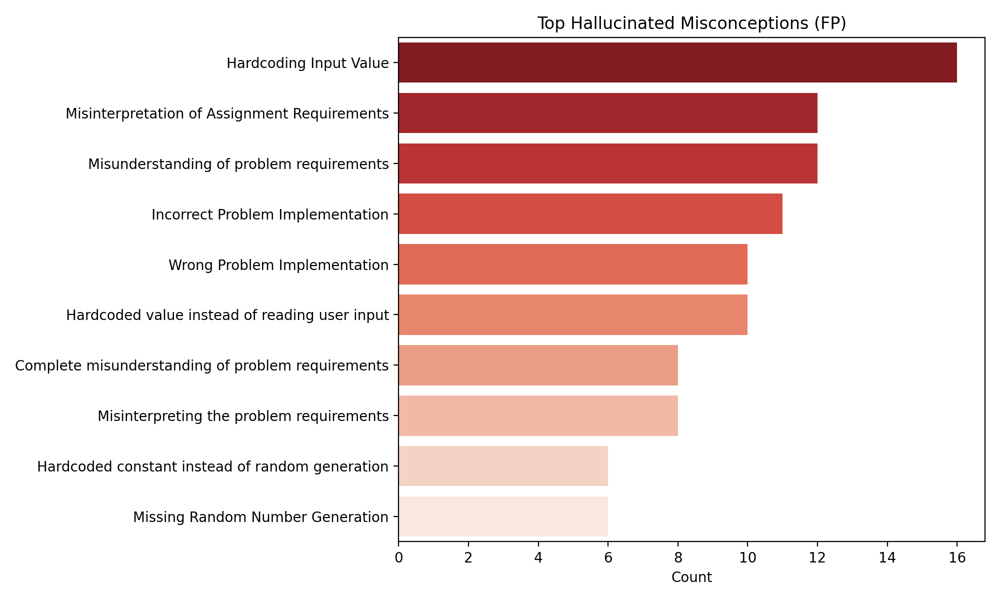

# LLM Misconception Detection: Analysis Report
_Generated: 2025-12-06T03:51:59.711851+00:00_

## Dataset & Run Configuration

### Dataset Summary
- **Assignment:** A2 – Kinematics & Geometry (CS1)
- **Students:** 60
- **Questions:** 4 (Q1, Q2, Q3, Q4)
- **Total files:** 240
- **Seeded files:** 54 (22.5%)
- **Clean files:** 186 (77.5%)
- **Detection opportunities:** 1296

### Run Configuration
- **Generation seed:** 1765012407
- **Generation model:** gpt-5.1-2025-11-13
- **Match mode:** all (ablation)
- **Embedding model:** text-embedding-3-large (OpenAI)
- **Detection models:** GPT-5.1, Gemini-2.5-Flash-Preview, Haiku-4.5
- **Strategies:** baseline, minimal, rubric_only, socratic

## Executive Highlights
- **Matcher Ablation Study**: Comparing fuzzy_only, semantic_only, and hybrid matchers.
- Bootstrap CIs included for statistical rigor.
- Same detection data, different matching strategies.

## The Diagnostic Ceiling (RQ1)

**Potential Recall** measures the theoretical upper bound: what percentage of seeded errors
were found by *at least one* model/strategy combination?

| Metric | Value |
|--------|-------|
| Potential Recall (Ceiling) | 98.1% |
| Average Recall (Reliability) | 68.1% |
| Consistency (Avg/Potential) | 69.4% |
| Unique Files Detected | 53 / 54 |

> [!TIP]
> High Ceiling: Most errors are detectable by at least one configuration.

## Cognitive Alignment (RQ2)

Does LLM performance correlate with the **cognitive depth** of the misconception?

| Depth Level | Recall | N |
|-------------|--------|---|
| notional | 68.9% | 672 |
| surface | 67.3% | 624 |

**Depth Gap (Surface - Notional):** -1.6%

> [!NOTE]
> No significant depth gap observed in this run.

## Matcher Ablation: Fuzzy vs Semantic vs Hybrid

### Summary (averaged across strategies and models)
| Matcher | Total TP | Total FP | Total FN | Avg Precision | Avg Recall | Avg F1 |
|---------|----------|----------|----------|---------------|------------|--------|
| fuzzy_only | 210 | 7697 | 1091 | 0.028 | 0.161 | 0.047 |
| hybrid | 1015 | 1924 | 413 | 0.353 | 0.710 | 0.469 |
| semantic_only | 997 | 3305 | 409 | 0.236 | 0.708 | 0.353 |

### Precision-Recall by Matcher

### Matcher × Strategy Distribution

### Full Results Table
| Matcher | Strategy | Model | TP | FP | FN | Precision | Recall | F1 | CI (F1) |
|---------|----------|-------|----|----|----|-----------|--------|----|---------|
| fuzzy_only | baseline | claude-haiku-4.5 | 12 | 263 | 43 | 0.044 | 0.218 | 0.073 | 0.04–0.11 |
| fuzzy_only | baseline | claude-haiku-4.5:reasoning | 8 | 271 | 47 | 0.029 | 0.145 | 0.048 | 0.02–0.09 |
| fuzzy_only | baseline | gemini-2.5-flash-preview-09-2025 | 15 | 304 | 40 | 0.047 | 0.273 | 0.080 | 0.04–0.13 |
| fuzzy_only | baseline | gemini-2.5-flash-preview-09-2025:reasoning | 9 | 333 | 45 | 0.026 | 0.167 | 0.045 | 0.02–0.08 |
| fuzzy_only | baseline | gpt-5.1 | 3 | 280 | 51 | 0.011 | 0.056 | 0.018 | 0.00–0.04 |
| fuzzy_only | baseline | gpt-5.1:reasoning | 9 | 284 | 45 | 0.031 | 0.167 | 0.052 | 0.02–0.08 |
| fuzzy_only | minimal | claude-haiku-4.5 | 14 | 339 | 40 | 0.040 | 0.259 | 0.069 | 0.04–0.10 |
| fuzzy_only | minimal | claude-haiku-4.5:reasoning | 12 | 276 | 42 | 0.042 | 0.222 | 0.070 | 0.03–0.11 |
| fuzzy_only | minimal | gemini-2.5-flash-preview-09-2025 | 11 | 362 | 43 | 0.029 | 0.204 | 0.052 | 0.02–0.08 |
| fuzzy_only | minimal | gemini-2.5-flash-preview-09-2025:reasoning | 11 | 394 | 43 | 0.027 | 0.204 | 0.048 | 0.02–0.07 |
| fuzzy_only | minimal | gpt-5.1 | 7 | 255 | 47 | 0.027 | 0.130 | 0.044 | 0.01–0.08 |
| fuzzy_only | minimal | gpt-5.1:reasoning | 7 | 245 | 47 | 0.028 | 0.130 | 0.046 | 0.01–0.08 |
| fuzzy_only | rubric_only | claude-haiku-4.5 | 11 | 288 | 45 | 0.037 | 0.196 | 0.062 | 0.02–0.11 |
| fuzzy_only | rubric_only | claude-haiku-4.5:reasoning | 7 | 165 | 47 | 0.041 | 0.130 | 0.062 | 0.02–0.11 |
| fuzzy_only | rubric_only | gemini-2.5-flash-preview-09-2025 | 6 | 331 | 48 | 0.018 | 0.111 | 0.031 | 0.01–0.06 |
| fuzzy_only | rubric_only | gemini-2.5-flash-preview-09-2025:reasoning | 7 | 364 | 47 | 0.019 | 0.130 | 0.033 | 0.01–0.06 |
| fuzzy_only | rubric_only | gpt-5.1 | 4 | 507 | 50 | 0.008 | 0.074 | 0.014 | 0.00–0.03 |
| fuzzy_only | rubric_only | gpt-5.1:reasoning | 6 | 520 | 48 | 0.011 | 0.111 | 0.021 | 0.01–0.04 |
| fuzzy_only | socratic | claude-haiku-4.5 | 5 | 226 | 49 | 0.022 | 0.093 | 0.035 | 0.01–0.07 |
| fuzzy_only | socratic | claude-haiku-4.5:reasoning | 7 | 227 | 47 | 0.030 | 0.130 | 0.049 | 0.02–0.09 |
| fuzzy_only | socratic | gemini-2.5-flash-preview-09-2025 | 10 | 311 | 44 | 0.031 | 0.185 | 0.053 | 0.03–0.08 |
| fuzzy_only | socratic | gemini-2.5-flash-preview-09-2025:reasoning | 14 | 366 | 40 | 0.037 | 0.259 | 0.065 | 0.04–0.10 |
| fuzzy_only | socratic | gpt-5.1 | 6 | 393 | 48 | 0.015 | 0.111 | 0.026 | 0.01–0.05 |
| fuzzy_only | socratic | gpt-5.1:reasoning | 9 | 393 | 45 | 0.022 | 0.167 | 0.039 | 0.02–0.07 |
| hybrid | baseline | claude-haiku-4.5 | 41 | 89 | 22 | 0.315 | 0.651 | 0.425 | 0.33–0.52 |
| hybrid | baseline | claude-haiku-4.5:reasoning | 38 | 64 | 22 | 0.373 | 0.633 | 0.469 | 0.37–0.56 |
| hybrid | baseline | gemini-2.5-flash-preview-09-2025 | 42 | 74 | 16 | 0.362 | 0.724 | 0.483 | 0.39–0.56 |
| hybrid | baseline | gemini-2.5-flash-preview-09-2025:reasoning | 43 | 74 | 16 | 0.368 | 0.729 | 0.489 | 0.40–0.58 |
| hybrid | baseline | gpt-5.1 | 36 | 60 | 21 | 0.375 | 0.632 | 0.471 | 0.37–0.56 |
| hybrid | baseline | gpt-5.1:reasoning | 38 | 61 | 20 | 0.384 | 0.655 | 0.484 | 0.39–0.57 |
| hybrid | minimal | claude-haiku-4.5 | 48 | 116 | 17 | 0.293 | 0.738 | 0.419 | 0.33–0.50 |
| hybrid | minimal | claude-haiku-4.5:reasoning | 41 | 69 | 14 | 0.373 | 0.745 | 0.497 | 0.41–0.60 |
| hybrid | minimal | gemini-2.5-flash-preview-09-2025 | 53 | 74 | 10 | 0.417 | 0.841 | 0.558 | 0.47–0.64 |
| hybrid | minimal | gemini-2.5-flash-preview-09-2025:reasoning | 47 | 91 | 14 | 0.341 | 0.770 | 0.472 | 0.39–0.55 |
| hybrid | minimal | gpt-5.1 | 45 | 46 | 13 | 0.495 | 0.776 | 0.604 | 0.51–0.69 |
| hybrid | minimal | gpt-5.1:reasoning | 41 | 50 | 17 | 0.451 | 0.707 | 0.550 | 0.44–0.65 |
| hybrid | rubric_only | claude-haiku-4.5 | 41 | 123 | 22 | 0.250 | 0.651 | 0.361 | 0.28–0.45 |
| hybrid | rubric_only | claude-haiku-4.5:reasoning | 41 | 60 | 17 | 0.406 | 0.707 | 0.516 | 0.42–0.61 |
| hybrid | rubric_only | gemini-2.5-flash-preview-09-2025 | 43 | 76 | 17 | 0.361 | 0.717 | 0.480 | 0.39–0.56 |
| hybrid | rubric_only | gemini-2.5-flash-preview-09-2025:reasoning | 39 | 94 | 18 | 0.293 | 0.684 | 0.411 | 0.32–0.50 |
| hybrid | rubric_only | gpt-5.1 | 39 | 111 | 19 | 0.260 | 0.672 | 0.375 | 0.28–0.45 |
| hybrid | rubric_only | gpt-5.1:reasoning | 40 | 102 | 19 | 0.282 | 0.678 | 0.398 | 0.31–0.49 |
| hybrid | socratic | claude-haiku-4.5 | 39 | 96 | 20 | 0.289 | 0.661 | 0.402 | 0.32–0.48 |
| hybrid | socratic | claude-haiku-4.5:reasoning | 40 | 70 | 19 | 0.364 | 0.678 | 0.473 | 0.38–0.57 |
| hybrid | socratic | gemini-2.5-flash-preview-09-2025 | 42 | 77 | 17 | 0.353 | 0.712 | 0.472 | 0.38–0.56 |
| hybrid | socratic | gemini-2.5-flash-preview-09-2025:reasoning | 49 | 89 | 13 | 0.355 | 0.790 | 0.490 | 0.41–0.56 |
| hybrid | socratic | gpt-5.1 | 51 | 77 | 12 | 0.398 | 0.810 | 0.534 | 0.42–0.62 |
| hybrid | socratic | gpt-5.1:reasoning | 38 | 81 | 18 | 0.319 | 0.679 | 0.434 | 0.35–0.53 |
| semantic_only | baseline | claude-haiku-4.5 | 39 | 149 | 21 | 0.207 | 0.650 | 0.315 | 0.24–0.39 |
| semantic_only | baseline | claude-haiku-4.5:reasoning | 38 | 136 | 21 | 0.218 | 0.644 | 0.326 | 0.25–0.39 |
| semantic_only | baseline | gemini-2.5-flash-preview-09-2025 | 38 | 129 | 17 | 0.228 | 0.691 | 0.342 | 0.28–0.40 |
| semantic_only | baseline | gemini-2.5-flash-preview-09-2025:reasoning | 42 | 129 | 16 | 0.246 | 0.724 | 0.367 | 0.30–0.43 |
| semantic_only | baseline | gpt-5.1 | 36 | 129 | 21 | 0.218 | 0.632 | 0.324 | 0.25–0.40 |
| semantic_only | baseline | gpt-5.1:reasoning | 38 | 132 | 20 | 0.224 | 0.655 | 0.333 | 0.25–0.41 |
| semantic_only | minimal | claude-haiku-4.5 | 49 | 175 | 16 | 0.219 | 0.754 | 0.339 | 0.26–0.42 |
| semantic_only | minimal | claude-haiku-4.5:reasoning | 41 | 114 | 14 | 0.265 | 0.745 | 0.390 | 0.32–0.47 |
| semantic_only | minimal | gemini-2.5-flash-preview-09-2025 | 49 | 134 | 11 | 0.268 | 0.817 | 0.403 | 0.32–0.47 |
| semantic_only | minimal | gemini-2.5-flash-preview-09-2025:reasoning | 46 | 141 | 14 | 0.246 | 0.767 | 0.372 | 0.30–0.44 |
| semantic_only | minimal | gpt-5.1 | 44 | 104 | 13 | 0.297 | 0.772 | 0.429 | 0.35–0.51 |
| semantic_only | minimal | gpt-5.1:reasoning | 40 | 107 | 17 | 0.272 | 0.702 | 0.392 | 0.31–0.47 |
| semantic_only | rubric_only | claude-haiku-4.5 | 42 | 175 | 21 | 0.194 | 0.667 | 0.300 | 0.22–0.38 |
| semantic_only | rubric_only | claude-haiku-4.5:reasoning | 41 | 93 | 17 | 0.306 | 0.707 | 0.427 | 0.34–0.51 |
| semantic_only | rubric_only | gemini-2.5-flash-preview-09-2025 | 41 | 111 | 17 | 0.270 | 0.707 | 0.390 | 0.32–0.47 |
| semantic_only | rubric_only | gemini-2.5-flash-preview-09-2025:reasoning | 39 | 137 | 18 | 0.222 | 0.684 | 0.335 | 0.26–0.40 |
| semantic_only | rubric_only | gpt-5.1 | 39 | 195 | 19 | 0.167 | 0.672 | 0.267 | 0.20–0.32 |
| semantic_only | rubric_only | gpt-5.1:reasoning | 39 | 199 | 19 | 0.164 | 0.672 | 0.264 | 0.20–0.33 |
| semantic_only | socratic | claude-haiku-4.5 | 41 | 149 | 19 | 0.216 | 0.683 | 0.328 | 0.26–0.40 |
| semantic_only | socratic | claude-haiku-4.5:reasoning | 40 | 108 | 17 | 0.270 | 0.702 | 0.390 | 0.30–0.47 |
| semantic_only | socratic | gemini-2.5-flash-preview-09-2025 | 39 | 114 | 18 | 0.255 | 0.684 | 0.371 | 0.29–0.45 |
| semantic_only | socratic | gemini-2.5-flash-preview-09-2025:reasoning | 48 | 140 | 13 | 0.255 | 0.787 | 0.386 | 0.31–0.44 |
| semantic_only | socratic | gpt-5.1 | 50 | 162 | 12 | 0.236 | 0.806 | 0.365 | 0.29–0.44 |
| semantic_only | socratic | gpt-5.1:reasoning | 38 | 143 | 18 | 0.210 | 0.679 | 0.321 | 0.24–0.39 |

## Topic Difficulty (Recall)
| Topic | Recall | N |
|-------|--------|---|
| Data Types | 0.417 | 216 |
| Control Flow | 0.427 | 288 |
| Syntax | 0.639 | 72 |
| Operators | 0.817 | 120 |
| Methods | 0.861 | 216 |
| Boolean Logic | 0.872 | 336 |
| Nested Loops | 0.979 | 48 |

## Topic Heatmap

## Topic Recall by Model

Grouped bar chart showing recall per topic, split by model. Reveals model-specific strengths and weaknesses.

## Model Agreement Matrix

Pairwise Cohen's κ between models. Higher values indicate correlated predictions; lower values suggest complementary errors (good for ensembles).

## Confidence Calibration Analysis

Distribution of model confidence scores for True Positives vs False Positives. A well-calibrated model should show higher confidence for TPs than FPs.

## Per-Misconception Detection Rates

Detection recall for each seeded misconception, sorted by difficulty (hardest to detect at top):

| ID | Misconception | Category | Recall | N |
|----|---------------|----------|--------|---|
| TYP-S03 | TYP-S03 | Data Types | 0.21 | 120 |
| FLO-04 | FLO-04 | Control Flow | 0.22 | 96 |
| FLO-01 | FLO-01 | Control Flow | 0.26 | 120 |
| SYN-S02 | SYN-S02 | Syntax | 0.54 | 48 |
| LOG-04 | LOG-04 | Boolean Logic | 0.56 | 48 |
| TYP-S02 | TYP-S02 | Data Types | 0.57 | 72 |
| API-S02 | API-S02 | Methods | 0.67 | 48 |
| OP-S02 | OP-S02 | Operators | 0.77 | 96 |
| SYN-S01 | SYN-S01 | Syntax | 0.83 | 24 |
| API-S03 | API-S03 | Methods | 0.86 | 96 |
| LOG-01 | LOG-01 | Boolean Logic | 0.87 | 144 |
| LOG-03 | LOG-03 | Boolean Logic | 0.97 | 96 |
| NES-01 | NES-01 | Nested Loops | 0.98 | 48 |
| FLO-02 | FLO-02 | Control Flow | 0.99 | 72 |
| API-S01 | API-S01 | Methods | 0.99 | 72 |
| LOG-02 | LOG-02 | Boolean Logic | 1.00 | 48 |
| TYP-S01 | TYP-S01 | Data Types | 1.00 | 24 |
| OP-S01 | OP-S01 | Operators | 1.00 | 24 |

## Hallucination Analysis

- **Misinterpreting the problem requirements** (120 times)
- **Misinterpretation of Assignment Requirements** (103 times)
- **Incorrect Problem Implementation** (85 times)
- **Complete misunderstanding of problem requirements** (71 times)
- **Misunderstanding of problem requirements** (69 times)

## Methods
- Data: 60 students × 4 questions (seeded/clean) with manifest-driven ground truth.
- Detection: GPT-5.1, Gemini-2.5-Flash-Preview, Haiku-4.5 across strategies (baseline, minimal, rubric_only, socratic).
- Matching: Ablation comparing fuzzy-only, semantic-only (text-embedding-3-large), and hybrid (fuzzy + semantic + topic prior).
- Metrics: Precision/Recall/F1 with bootstrap CIs; agreement via κ; significance via McNemar where applicable.

## Agreement & Significance
- baseline (claude-haiku-4.5 vs claude-haiku-4.5:reasoning): κ=0.693, McNemar p=0.8597 (stat=0.031) | table={'both_correct': 28, 'only_a': 4, 'only_b': 4, 'both_wrong': 18}
- baseline (claude-haiku-4.5 vs gemini-2.5-flash-preview-09-2025): κ=0.599, McNemar p=0.0820 (stat=3.025) | table={'both_correct': 30, 'only_a': 2, 'only_b': 8, 'both_wrong': 14}
- baseline (claude-haiku-4.5 vs gemini-2.5-flash-preview-09-2025:reasoning): κ=0.680, McNemar p=0.0518 (stat=3.781) | table={'both_correct': 31, 'only_a': 1, 'only_b': 7, 'both_wrong': 15}
- baseline (claude-haiku-4.5 vs gpt-5.1): κ=0.575, McNemar p=0.8802 (stat=0.023) | table={'both_correct': 27, 'only_a': 5, 'only_b': 6, 'both_wrong': 16}
- baseline (claude-haiku-4.5 vs gpt-5.1:reasoning): κ=0.455, McNemar p=0.6885 (stat=0.161) | table={'both_correct': 26, 'only_a': 6, 'only_b': 8, 'both_wrong': 14}
- baseline (claude-haiku-4.5:reasoning vs gemini-2.5-flash-preview-09-2025): κ=0.519, McNemar p=0.1124 (stat=2.521) | table={'both_correct': 29, 'only_a': 3, 'only_b': 9, 'both_wrong': 13}
- baseline (claude-haiku-4.5:reasoning vs gemini-2.5-flash-preview-09-2025:reasoning): κ=0.599, McNemar p=0.0820 (stat=3.025) | table={'both_correct': 30, 'only_a': 2, 'only_b': 8, 'both_wrong': 14}
- baseline (claude-haiku-4.5:reasoning vs gpt-5.1): κ=0.498, McNemar p=0.8897 (stat=0.019) | table={'both_correct': 26, 'only_a': 6, 'only_b': 7, 'both_wrong': 15}
- baseline (claude-haiku-4.5:reasoning vs gpt-5.1:reasoning): κ=0.455, McNemar p=0.6885 (stat=0.161) | table={'both_correct': 26, 'only_a': 6, 'only_b': 8, 'both_wrong': 14}
- baseline (gemini-2.5-flash-preview-09-2025 vs gemini-2.5-flash-preview-09-2025:reasoning): κ=0.734, McNemar p=0.8383 (stat=0.042) | table={'both_correct': 35, 'only_a': 3, 'only_b': 3, 'both_wrong': 13}
- baseline (gemini-2.5-flash-preview-09-2025 vs gpt-5.1): κ=0.471, McNemar p=0.2120 (stat=1.558) | table={'both_correct': 29, 'only_a': 9, 'only_b': 4, 'both_wrong': 12}
- baseline (gemini-2.5-flash-preview-09-2025 vs gpt-5.1:reasoning): κ=0.503, McNemar p=0.3123 (stat=1.021) | table={'both_correct': 30, 'only_a': 8, 'only_b': 4, 'both_wrong': 12}
- baseline (gemini-2.5-flash-preview-09-2025:reasoning vs gpt-5.1): κ=0.633, McNemar p=0.1336 (stat=2.250) | table={'both_correct': 31, 'only_a': 7, 'only_b': 2, 'both_wrong': 14}
- baseline (gemini-2.5-flash-preview-09-2025:reasoning vs gpt-5.1:reasoning): κ=0.586, McNemar p=0.2684 (stat=1.225) | table={'both_correct': 31, 'only_a': 7, 'only_b': 3, 'both_wrong': 13}
- baseline (gpt-5.1 vs gpt-5.1:reasoning): κ=0.725, McNemar p=0.8501 (stat=0.036) | table={'both_correct': 30, 'only_a': 3, 'only_b': 4, 'both_wrong': 17}
- minimal (claude-haiku-4.5 vs claude-haiku-4.5:reasoning): κ=0.414, McNemar p=0.4881 (stat=0.481) | table={'both_correct': 32, 'only_a': 5, 'only_b': 8, 'both_wrong': 9}
- minimal (claude-haiku-4.5 vs gemini-2.5-flash-preview-09-2025): κ=0.662, McNemar p=0.0140 (stat=6.036) | table={'both_correct': 37, 'only_a': 0, 'only_b': 7, 'both_wrong': 10}
- minimal (claude-haiku-4.5 vs gemini-2.5-flash-preview-09-2025:reasoning): κ=0.684, McNemar p=0.3447 (stat=0.893) | table={'both_correct': 35, 'only_a': 2, 'only_b': 5, 'both_wrong': 12}
- minimal (claude-haiku-4.5 vs gpt-5.1): κ=0.542, McNemar p=0.2684 (stat=1.225) | table={'both_correct': 34, 'only_a': 3, 'only_b': 7, 'both_wrong': 10}
- minimal (claude-haiku-4.5 vs gpt-5.1:reasoning): κ=0.485, McNemar p=0.8852 (stat=0.021) | table={'both_correct': 31, 'only_a': 6, 'only_b': 6, 'both_wrong': 11}
- minimal (claude-haiku-4.5:reasoning vs gemini-2.5-flash-preview-09-2025): κ=0.469, McNemar p=0.2684 (stat=1.225) | table={'both_correct': 37, 'only_a': 3, 'only_b': 7, 'both_wrong': 7}
- minimal (claude-haiku-4.5:reasoning vs gemini-2.5-flash-preview-09-2025:reasoning): κ=0.325, McNemar p=0.8937 (stat=0.018) | table={'both_correct': 33, 'only_a': 7, 'only_b': 7, 'both_wrong': 7}
- minimal (claude-haiku-4.5:reasoning vs gpt-5.1): κ=0.358, McNemar p=0.8897 (stat=0.019) | table={'both_correct': 34, 'only_a': 6, 'only_b': 7, 'both_wrong': 7}
- minimal (claude-haiku-4.5:reasoning vs gpt-5.1:reasoning): κ=0.504, McNemar p=0.4510 (stat=0.568) | table={'both_correct': 33, 'only_a': 7, 'only_b': 4, 'both_wrong': 10}
- minimal (gemini-2.5-flash-preview-09-2025 vs gemini-2.5-flash-preview-09-2025:reasoning): κ=0.469, McNemar p=0.2684 (stat=1.225) | table={'both_correct': 37, 'only_a': 7, 'only_b': 3, 'both_wrong': 7}
- minimal (gemini-2.5-flash-preview-09-2025 vs gpt-5.1): κ=0.505, McNemar p=0.4047 (stat=0.694) | table={'both_correct': 38, 'only_a': 6, 'only_b': 3, 'both_wrong': 7}
- minimal (gemini-2.5-flash-preview-09-2025 vs gpt-5.1:reasoning): κ=0.275, McNemar p=0.0933 (stat=2.817) | table={'both_correct': 33, 'only_a': 11, 'only_b': 4, 'both_wrong': 6}
- minimal (gemini-2.5-flash-preview-09-2025:reasoning vs gpt-5.1): κ=0.556, McNemar p=0.8676 (stat=0.028) | table={'both_correct': 36, 'only_a': 4, 'only_b': 5, 'both_wrong': 9}
- minimal (gemini-2.5-flash-preview-09-2025:reasoning vs gpt-5.1:reasoning): κ=0.504, McNemar p=0.4510 (stat=0.568) | table={'both_correct': 33, 'only_a': 7, 'only_b': 4, 'both_wrong': 10}
- minimal (gpt-5.1 vs gpt-5.1:reasoning): κ=0.633, McNemar p=0.2159 (stat=1.531) | table={'both_correct': 35, 'only_a': 6, 'only_b': 2, 'both_wrong': 11}
- rubric_only (claude-haiku-4.5 vs claude-haiku-4.5:reasoning): κ=0.563, McNemar p=0.1748 (stat=1.841) | table={'both_correct': 29, 'only_a': 3, 'only_b': 8, 'both_wrong': 14}
- rubric_only (claude-haiku-4.5 vs gemini-2.5-flash-preview-09-2025): κ=0.324, McNemar p=0.2751 (stat=1.191) | table={'both_correct': 26, 'only_a': 6, 'only_b': 11, 'both_wrong': 11}
- rubric_only (claude-haiku-4.5 vs gemini-2.5-flash-preview-09-2025:reasoning): κ=0.447, McNemar p=0.3496 (stat=0.875) | table={'both_correct': 27, 'only_a': 5, 'only_b': 9, 'both_wrong': 13}
- rubric_only (claude-haiku-4.5 vs gpt-5.1): κ=0.412, McNemar p=0.5186 (stat=0.417) | table={'both_correct': 26, 'only_a': 6, 'only_b': 9, 'both_wrong': 13}
- rubric_only (claude-haiku-4.5 vs gpt-5.1:reasoning): κ=0.491, McNemar p=0.4881 (stat=0.481) | table={'both_correct': 27, 'only_a': 5, 'only_b': 8, 'both_wrong': 14}
- rubric_only (claude-haiku-4.5:reasoning vs gemini-2.5-flash-preview-09-2025): κ=0.485, McNemar p=0.8852 (stat=0.021) | table={'both_correct': 31, 'only_a': 6, 'only_b': 6, 'both_wrong': 11}
- rubric_only (claude-haiku-4.5:reasoning vs gemini-2.5-flash-preview-09-2025:reasoning): κ=0.535, McNemar p=0.8802 (stat=0.023) | table={'both_correct': 31, 'only_a': 6, 'only_b': 5, 'both_wrong': 12}
- rubric_only (claude-haiku-4.5:reasoning vs gpt-5.1): κ=0.501, McNemar p=0.6650 (stat=0.188) | table={'both_correct': 30, 'only_a': 7, 'only_b': 5, 'both_wrong': 12}
- rubric_only (claude-haiku-4.5:reasoning vs gpt-5.1:reasoning): κ=0.584, McNemar p=0.6353 (stat=0.225) | table={'both_correct': 31, 'only_a': 6, 'only_b': 4, 'both_wrong': 13}
- rubric_only (gemini-2.5-flash-preview-09-2025 vs gemini-2.5-flash-preview-09-2025:reasoning): κ=0.535, McNemar p=0.8802 (stat=0.023) | table={'both_correct': 31, 'only_a': 6, 'only_b': 5, 'both_wrong': 12}
- rubric_only (gemini-2.5-flash-preview-09-2025 vs gpt-5.1): κ=0.418, McNemar p=0.6885 (stat=0.161) | table={'both_correct': 29, 'only_a': 8, 'only_b': 6, 'both_wrong': 11}
- rubric_only (gemini-2.5-flash-preview-09-2025 vs gpt-5.1:reasoning): κ=0.501, McNemar p=0.6650 (stat=0.188) | table={'both_correct': 30, 'only_a': 7, 'only_b': 5, 'both_wrong': 12}
- rubric_only (gemini-2.5-flash-preview-09-2025:reasoning vs gpt-5.1): κ=0.466, McNemar p=0.8897 (stat=0.019) | table={'both_correct': 29, 'only_a': 7, 'only_b': 6, 'both_wrong': 12}
- rubric_only (gemini-2.5-flash-preview-09-2025:reasoning vs gpt-5.1:reasoning): κ=0.384, McNemar p=0.8973 (stat=0.017) | table={'both_correct': 28, 'only_a': 8, 'only_b': 7, 'both_wrong': 11}
- rubric_only (gpt-5.1 vs gpt-5.1:reasoning): κ=0.432, McNemar p=0.8937 (stat=0.018) | table={'both_correct': 28, 'only_a': 7, 'only_b': 7, 'both_wrong': 12}
- socratic (claude-haiku-4.5 vs claude-haiku-4.5:reasoning): κ=0.719, McNemar p=0.8501 (stat=0.036) | table={'both_correct': 31, 'only_a': 3, 'only_b': 4, 'both_wrong': 16}
- socratic (claude-haiku-4.5 vs gemini-2.5-flash-preview-09-2025): κ=0.467, McNemar p=0.4881 (stat=0.481) | table={'both_correct': 29, 'only_a': 5, 'only_b': 8, 'both_wrong': 12}
- socratic (claude-haiku-4.5 vs gemini-2.5-flash-preview-09-2025:reasoning): κ=0.444, McNemar p=0.0714 (stat=3.250) | table={'both_correct': 31, 'only_a': 3, 'only_b': 10, 'both_wrong': 10}
- socratic (claude-haiku-4.5 vs gpt-5.1): κ=0.394, McNemar p=0.0450 (stat=4.018) | table={'both_correct': 31, 'only_a': 3, 'only_b': 11, 'both_wrong': 9}
- socratic (claude-haiku-4.5 vs gpt-5.1:reasoning): κ=0.432, McNemar p=0.6885 (stat=0.161) | table={'both_correct': 28, 'only_a': 6, 'only_b': 8, 'both_wrong': 12}
- socratic (claude-haiku-4.5:reasoning vs gemini-2.5-flash-preview-09-2025): κ=0.584, McNemar p=0.6353 (stat=0.225) | table={'both_correct': 31, 'only_a': 4, 'only_b': 6, 'both_wrong': 13}
- socratic (claude-haiku-4.5:reasoning vs gemini-2.5-flash-preview-09-2025:reasoning): κ=0.475, McNemar p=0.1124 (stat=2.521) | table={'both_correct': 32, 'only_a': 3, 'only_b': 9, 'both_wrong': 10}
- socratic (claude-haiku-4.5:reasoning vs gpt-5.1): κ=0.424, McNemar p=0.0714 (stat=3.250) | table={'both_correct': 32, 'only_a': 3, 'only_b': 10, 'both_wrong': 9}
- socratic (claude-haiku-4.5:reasoning vs gpt-5.1:reasoning): κ=0.466, McNemar p=0.8897 (stat=0.019) | table={'both_correct': 29, 'only_a': 6, 'only_b': 7, 'both_wrong': 12}
- socratic (gemini-2.5-flash-preview-09-2025 vs gemini-2.5-flash-preview-09-2025:reasoning): κ=0.725, McNemar p=0.1530 (stat=2.042) | table={'both_correct': 36, 'only_a': 1, 'only_b': 5, 'both_wrong': 12}
- socratic (gemini-2.5-flash-preview-09-2025 vs gpt-5.1): κ=0.487, McNemar p=0.1748 (stat=1.841) | table={'both_correct': 34, 'only_a': 3, 'only_b': 8, 'both_wrong': 9}
- socratic (gemini-2.5-flash-preview-09-2025 vs gpt-5.1:reasoning): κ=0.704, McNemar p=0.8501 (stat=0.036) | table={'both_correct': 33, 'only_a': 4, 'only_b': 3, 'both_wrong': 14}
- socratic (gemini-2.5-flash-preview-09-2025:reasoning vs gpt-5.1): κ=0.428, McNemar p=0.8802 (stat=0.023) | table={'both_correct': 36, 'only_a': 5, 'only_b': 6, 'both_wrong': 7}
- socratic (gemini-2.5-flash-preview-09-2025:reasoning vs gpt-5.1:reasoning): κ=0.507, McNemar p=0.1748 (stat=1.841) | table={'both_correct': 33, 'only_a': 8, 'only_b': 3, 'both_wrong': 10}
- socratic (gpt-5.1 vs gpt-5.1:reasoning): κ=0.636, McNemar p=0.0518 (stat=3.781) | table={'both_correct': 35, 'only_a': 7, 'only_b': 1, 'both_wrong': 11}